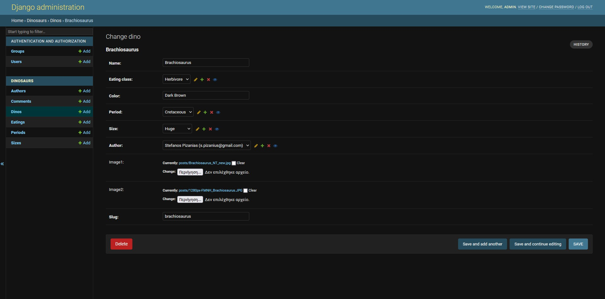
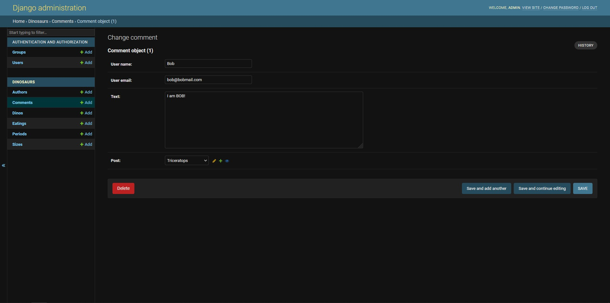
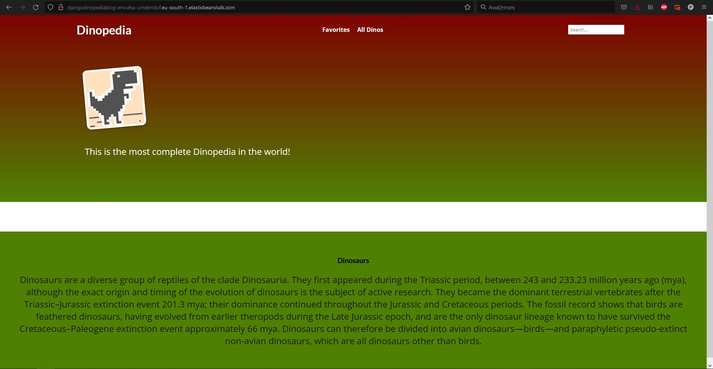
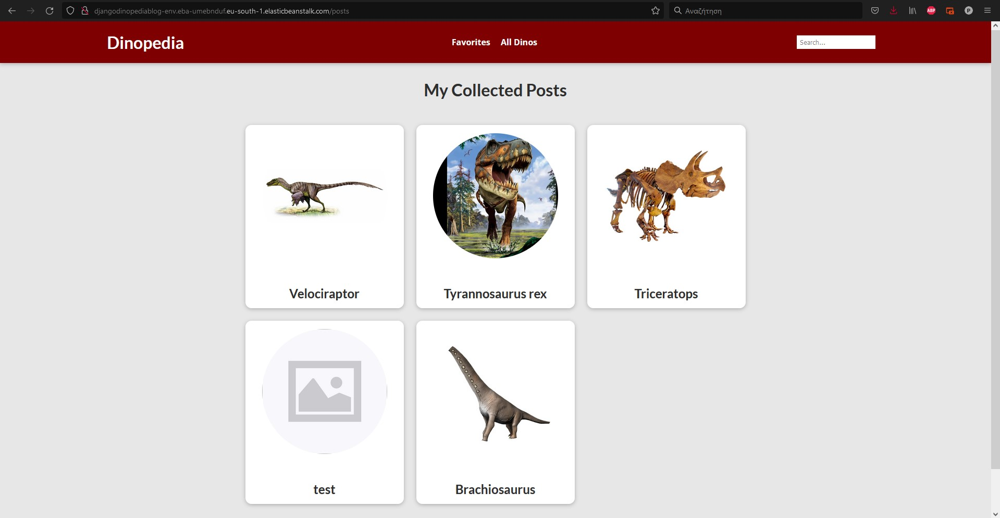
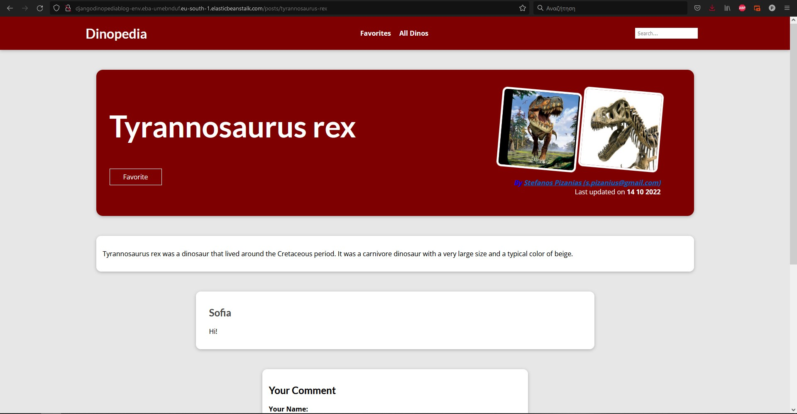
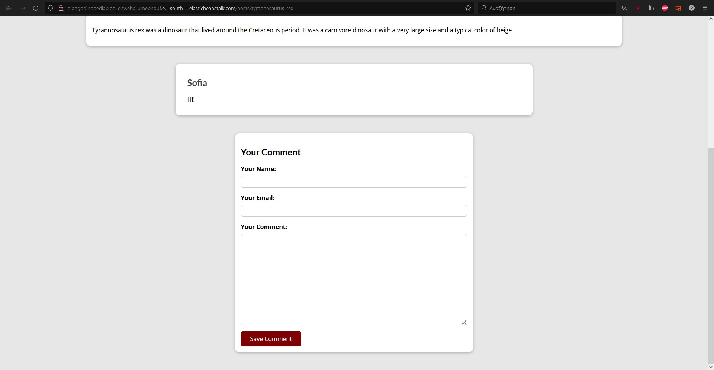
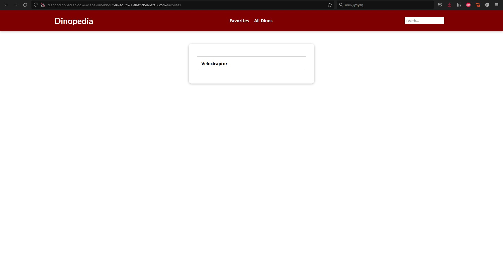
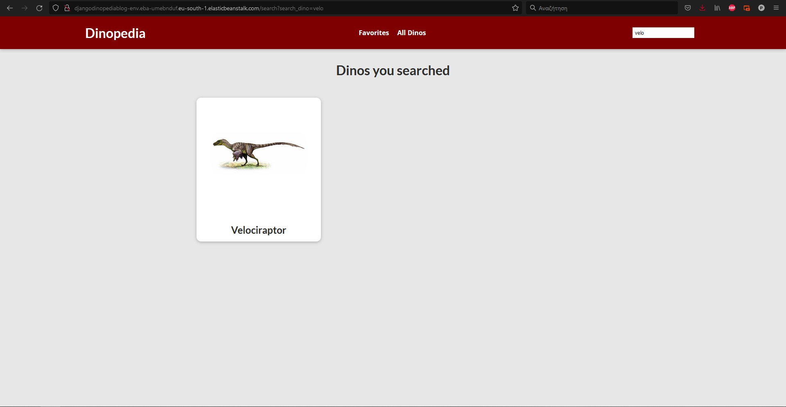
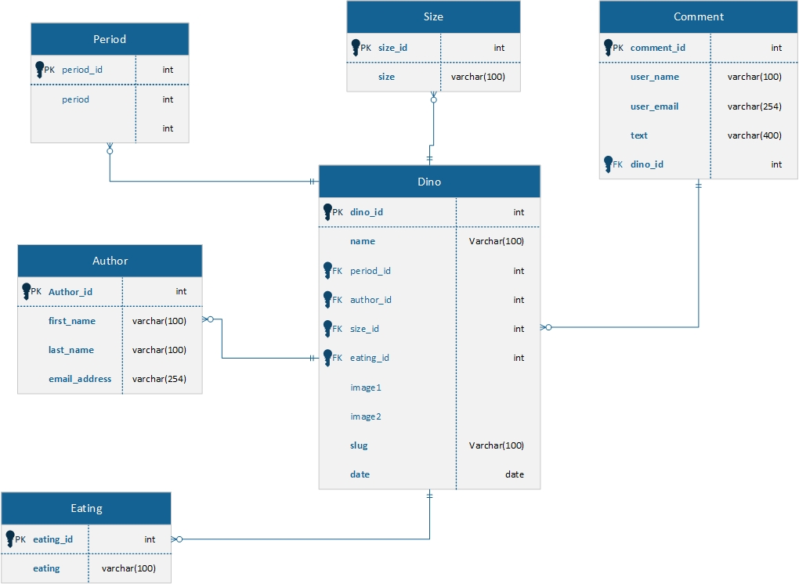

# GlobalWebIndex Python Challenge - v1 | Exercise: DinosaursAficionado

### Acknowledgments 
The Dino project first started as a technical assignment for an interview with GWI so base idea of the project came
from GWI. Everything after the base idea was created by me (except the poetry file).

### Deployment
The application has been deployed in AWS Elastic Beanstalk with the static files been handled from Elastic Beanstalk,
because unfortunately my free tier account was not able to handle the AWS S3 storage without charging me.

The database that was used is PostgreSQL deployed in AWS RDS. 

[Click me to see the site!](http://djangodinopediablog-env.eba-umebnduf.eu-south-1.elasticbeanstalk.com/)

### Admin
As an admin you can add a kind of dino with his attributes (Name, Eating Class, Period, 
Size, Color, Author and up to 2 images for each dino)

You have the ability to review, adjust and delete all the existing dinos their attributes
and the comments made by users.

I created some test dinosaurs feel free to fidle with everything you want.

### Dinopedia

There is a main page with a Favorites, All Posts and a search bar function.

In All Posts page you can see all the dinos and click on them

Each dino has a unique slug that is autogenerated from its name and used for identification and the url.
You can see the information for each dino.

There is a Comments section for each dino with some test comments, every user can comment on a post.

Each user can add some dinos to his favorites and view them as a list.

There is a search bar to search for different kinds of dinos.

### Database Diagram

### Contact
If you have any questions don't hesitate to contact me at <s.pizanius@gmail.com>

